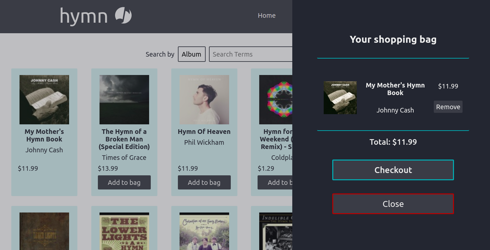

<div id="top"></div>
<h1 align="center">hymn</h1>

  <p align="center">
    A music store for music lovers.
    <br />
    <br />
    <a href="https://leau-void.github.io/shopping-cart">View Demo</a>
    ·
    <a href="https://github.com/leau-void/shopping-cart/issues">Report Bug</a>
    ·
    <a href="https://github.com/leau-void/shopping-cart">Request Feature</a>
  </p>
</div>

## About The Project

[](https://leau-void.github.io/shopping-cart/)

<a href="#preview">More screenshots</a>

hymn is a front-end store mockup, that fetches data from the iTunes API and allows shoppers to add products to their shopping bag.

<small>* If you are on mobile iOS and the animations are not working, close your browser and re-open it and it should work.</small>


## Getting started

```
git clone https://github.com/leau-void/shopping-cart.git
cd shopping-cart
npm install
npm start
```

## Built With

- [React](https://reactjs.org/)
- [React Hooks](https://reactjs.org/docs/hooks-intro.html)
- [React Context API](https://reactjs.org/docs/context.html)
- [CreateReactApp](https://github.com/facebook/create-react-app/)
- [iTunes API](https://resources.organicfruitapps.com/documentation/itunes-store-web-service-search-api/)
- [Animate -- reusable React component I wrote for animating mounting and unmounting of components](src/utils/Animate.js)
- [styled-components](https://styled-components.com/)
- [styled-icons](https://github.com/styled-icons/styled-icons)
- [Framer Motion](https://www.framer.com/motion/)

## Preview

### Desktop
<div align="center">
<a href="https://leau-void.github.io/shopping-cart/"></a>
<a href="https://leau-void.github.io/shopping-cart/"></a>
<a href="https://leau-void.github.io/shopping-cart/"></a>
</div>

### Mobile 
<div align="center">
<a href="https://leau-void.github.io/shopping-cart/"></a>
<a href="https://leau-void.github.io/shopping-cart/"></a>
<a href="https://leau-void.github.io/shopping-cart/"></a>
</div>

## Contact

Leau P - [LinkedIn](https://www.linkedin.com/in/leau-p) - lpierra@gmail.com

Project Link: [https://github.com/leau-void/shopping-cart](https://github.com/leau-void/shopping-cart)

<p align="right">(<a href="#top">back to top</a>)</p>

